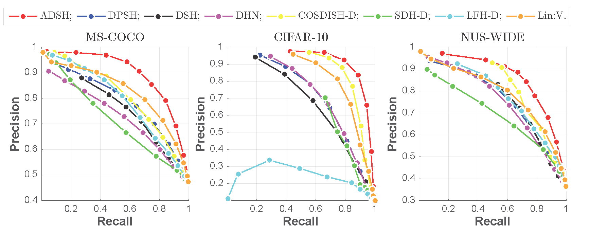
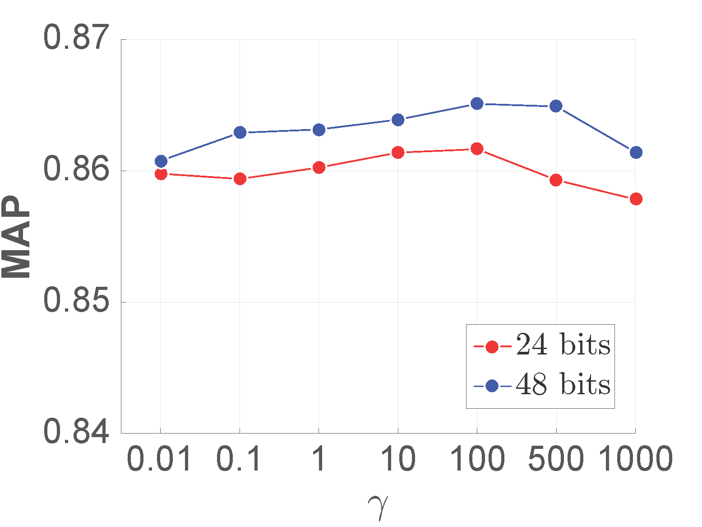
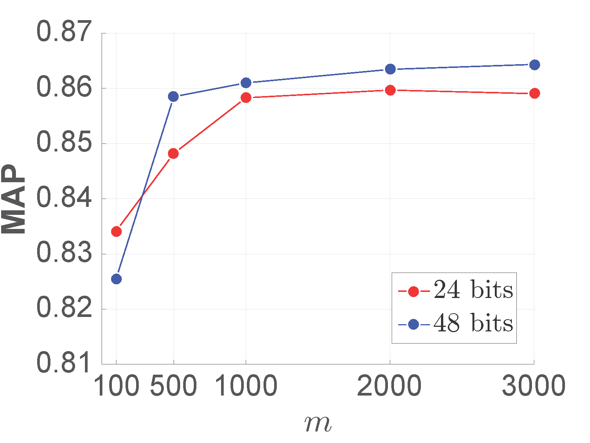

---
#  Source code for ADSH-AAAI2018 [Matlab Version]
---
## Introduction
### 1. Running Environment
Matlab 2016

[MatConvnet](http://www.vlfeat.org/matconvnet/)
### 2. Datasets
We use three datasets to perform our experiments, i.e., CIFAR-10, MS-COCO and NUS-WIDE. You can preprocess these datasets by yourself or download from the following links:

[CIFAR-10 MAT File](http://pan.baidu.com/s/1hr7Loji)

[MS-COCO MAT File](http://pan.baidu.com/s/1dFAPeZv)

NUS-WIDE MAT File:

link: https://pan.baidu.com/s/1gY6plKKcbpIi42b9GKCR1g 

password: y9rx

In addition, pretrained model can be download from the following links:

[VGG-F](http://pan.baidu.com/s/1slhusrF)

### 3. Run demo
First you need download (or prepross by yourself) coresponding data and pretrained model and put them in the "data" folder. Then complie and run setup.m to configure MatConvNet.
Then run ADSH_demo().

```matlab
ADSH_demo
```

### 4. Result
#### 4.1. Mean Average Precision (MAP).
<table>
    <tr>
        <td rowspan="2">PlatForm</td>    
        <td colspan="4">Code Length</td>
    </tr>
    <tr>
        <td >12 bits</td><td >24 bits</td> <td >32 bits</td><td >48 bits</td>  
    </tr>
    <tr>
        <td >CIFAR-10</td ><td >0.8939 </td> <td > 0.9243 </td><td > 0.9330</td><td > 0.9426</td>  
    </tr>
    <tr>
        <td >MS-COCO</td ><td >0.8344 </td> <td >0.8601 </td><td >0.8613 </td> <td >0.8612 </td>
    </tr>
    <tr>
        <td >NUS-WIDE</td ><td >0.8374 </td> <td > 0.8898</td><td > 0.8954</td> <td > 0.9060</td>
    </tr>
</table>

#### 4.2. Precision-Recall

<div align=center></div>

#### 4.3. Training Loss on MS-COCO dataset.

<div align=center></div>

#### 4.4.  Hyper-parameters on MS-COCO dataset.
##### 4.4.1. $\gamma$

<div align=center></div>

##### 4.4.2. $m$

<div align=center></div>


### 5. Please contact jiangqy@lamda.nju.edu.cn if you have any question.